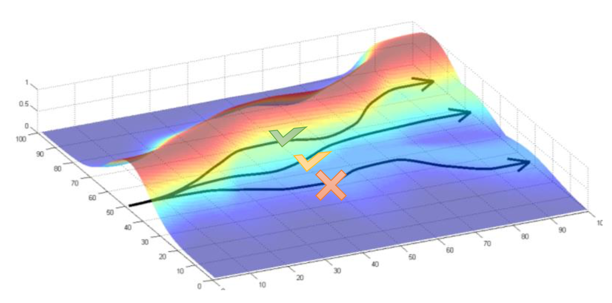
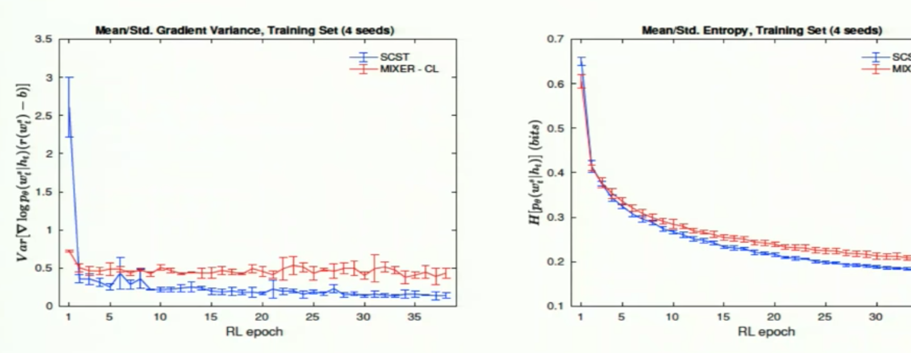

<section id="nice" data-tool="mdnice编辑器" data-website="https://www.mdnice.com" style="font-size: 16px; color: black; padding: 0 10px; line-height: 1.6; word-spacing: 0px; letter-spacing: 0px; word-break: break-word; word-wrap: break-word; text-align: left; font-family: Optima-Regular, Optima, PingFangSC-light, PingFangTC-light, 'PingFang SC', Cambria, Cochin, Georgia, Times, 'Times New Roman', serif;"><h3 data-tool="mdnice编辑器" style="margin-top: 30px; margin-bottom: 15px; padding: 0px; font-weight: bold; color: black; font-size: 20px;">论文笔记：Self-Critical Sequence Training</h3>

本篇论文的 SCST 是 IBM Watson 提出的 Image Captioning 模型。SCST 是 REINFORCE 算法的一个变种，利用自己的 test-time inference algorithm 来对 reward 作标准化（这里 reward 即句子的评分），也就是给 REINFORCE 算法提供一个更有效的 baseline 。这与先前通过估算 baseline 方法来标准化 rewards、减少方差的方法不同。

<h3 data-tool="mdnice编辑器" style="margin-top: 30px; margin-bottom: 15px; padding: 0px; font-weight: bold; color: black; font-size: 20px;">解决了什么问题</h3>
<!-- ##### Image Captioning
主要问题是，使用Nearest Neighbor Search，搜索空间过大 -->
<h5 data-tool="mdnice编辑器" style="margin-top: 30px; margin-bottom: 15px; padding: 0px; font-weight: bold; color: black; font-size: 16px;">Exposure Bias</h5>

传统的<em style="font-style: italic; color: black;">Teacher Forcing</em>方法在训练时是将目标输出( training set 的 ground-truth)作为 RNN 的输入，同时用网络自己的一次性预测做多步采样。以 ground-truth 文本而非生成的词语作为先验。

在测试的时候，网络依赖的是自己生成的单词，一旦生成得不好就会导致误差积累，后面的单词也生成得不好，一步错则步步错。

以往这个问题是用<em style="font-style: italic; color: black;">Professor Forcing</em>解决的，它使用 adversarial training 即对抗训练，来使从网络中采样的上文词汇尽量贴合 ground truth。

<h3 data-tool="mdnice编辑器" style="margin-top: 30px; margin-bottom: 15px; padding: 0px; font-weight: bold; color: black; font-size: 20px;">Why Reinforcement Learning?</h3>
<!--
$\theta _ { t + 1 } = \theta _ { t } + \alpha \nabla \overline{ { J } ( \theta _ { t } )}$

这里 $\overline{ { J } ( \theta _ { t } )}$ 即是对模型表现的梯度预测 -->

我们知道强化学习解决的问题就是<strong style="font-weight: bold; color: black;">一个 agent 如何在一个 environment 中采取行动以使 cumulative reward 最大化</strong>。这个 environment 指 agent 作用的对象，比如在 Atari 里是游戏本身。

RL 问题可以用 Markov Decision Process 来建模，其可概括为几大要素： 
: environment 和 agent 的状态集合 
: agent 的动作集合 
: 状态转移方程，agent 在  时间采取行动  从状态  转移到状态  的概率。在状态集和动作集离散且非连续时，通常可以用一个庞大的矩阵来表示，即状态转移矩阵。

而为什么 Sequence Generation 这类问题可以用 RL 来解决，我理解是由于生成单词的操作是不可微的，无法通过反向传播来直接优化这些指标。

NLP 使用的预测模型，比如类 RNN 和 LSTM 模型，可以看作与一个外部环境（这里就是上文单词和图像特征）交互的 agent。

<h3 data-tool="mdnice编辑器" style="margin-top: 30px; margin-bottom: 15px; padding: 0px; font-weight: bold; color: black; font-size: 20px;">Policy Gradient (PG)</h3>

Policy gradient 本身就是 evaluation-based method，其 agent 可以自己探索文本更好的解释。我们可以这样用 PG 来 model NLG 或 NLU 等任务：

<h5 data-tool="mdnice编辑器" style="margin-top: 30px; margin-bottom: 15px; padding: 0px; font-weight: bold; color: black; font-size: 16px;">Environment</h5>

 - 输入图像（或者说<strong style="font-weight: bold; color: black;">ResNet</strong>提取过的图像特征） 
 - 即  步以前生成的所有单词

<h5 data-tool="mdnice编辑器" style="margin-top: 30px; margin-bottom: 15px; padding: 0px; font-weight: bold; color: black; font-size: 16px;">Action</h5>

，t 步生成的一个单词

<h5 data-tool="mdnice编辑器" style="margin-top: 30px; margin-bottom: 15px; padding: 0px; font-weight: bold; color: black; font-size: 16px;">Rewards</h5>

 或者 。模型训练的衡量指标。这里最后一个时间点  输出的文本即是[EOS]

<h5 data-tool="mdnice编辑器" style="margin-top: 30px; margin-bottom: 15px; padding: 0px; font-weight: bold; color: black; font-size: 16px;">Objective function</h5>

训练目标是最小化目标函数，即 negative rewards

<h5 data-tool="mdnice编辑器" style="margin-top: 30px; margin-bottom: 15px; padding: 0px; font-weight: bold; color: black; font-size: 16px;">Policy</h5>

 决定了对下一个单词的预测，可以看作是 agent 的一个“动作”（ 是策略  的网络参数）。

梯度期望可以用一个从策略  中 sample 的 Monte Carlo 样本  做估计：. REINFORCE 给出的策略梯度可以进而用于计算相对于 reference reward (即 baseline )的 action value 的奖励：

对于策略梯度更详细的解读，可以参考<a href="https://developer.ibm.com/zh/technologies/analytics/articles/ba-lo-deep-introduce-policy-gradient/" style="text-decoration: none; color: #1e6bb8; word-wrap: break-word; font-weight: bold; border-bottom: 1px solid #1e6bb8;">IBM 这篇文章</a>

<h3 data-tool="mdnice编辑器" style="margin-top: 30px; margin-bottom: 15px; padding: 0px; font-weight: bold; color: black; font-size: 20px;">REINFORCE with baseline</h3>

为什么引入 baseline 方法，我理解是 baseline 就是一个学习到的 value function，其本质上是对文本对应的 reward 起到一个 zero-centering 的作用。当策略已经较好时，我们预测一个不太好的样本，其输出的 reward 是一个非负的小值，这就导致传统的策略梯度算法会继续尝试增加产生这个轨迹的动作的概率，放到 Levine 著名的图里，就是把  对应的 trajectory  提升上来，这里纵轴是动作产生概率。

这样，当我们 normalize 之后会导致学习效果不升反降。所以我们需要引入一个基准值，使得算法能够增加优于基准值的动作的概率，降低低于基准值动作的概率。

在策略  下生成所有可能的 sequence 的 probability 之和为 1

只要  对于动作 、状态  及所用策略的参数  都是可导的

Baseline 不会改变梯度期望，但可以显著减小梯度估计的方差

如果在 reward function 上减去一个任意的基线 ，结论仍然是成立的。这个 baseline  可以是不取决于  的任何方法。

<h3 data-tool="mdnice编辑器" style="margin-top: 30px; margin-bottom: 15px; padding: 0px; font-weight: bold; color: black; font-size: 20px;">模型结构</h3>

Encoder 使用<em style="font-style: italic; color: black;">ResNet-101</em>来生成图像特征，以 cross entropy loss 训练。 
Decoder 使用<em style="font-style: italic; color: black;">LSTM</em>来 decode feature。LSTM 最后输出的是每个单词的分数 ，再通过 softmax 得到下一个单词  的概率分布。本文利用的是修改过的 Attention Model(Att2in)，把 attention feature 输入到 LSTM 的 cell node。使用 attention 能够让模型在不同时间点上聚焦不同的图像空间特征（即 CNN encoder 的输出）。

我们可以看到每个单词的权重是由采样得到的 reward 和 test 时 inference 算法估计的 reward 之差决定的。SCST 是用 inference 算法取代 actor-critic 中的 critic 网络。

<h2 data-tool="mdnice编辑器" style="margin-top: 30px; margin-bottom: 15px; padding: 0px; font-weight: bold; color: black; font-size: 22px;">Results</h2>

SCST 在 training set 上的方差与熵值。 
前几个 epoch 时，算法处在 RL 的 Exploration 阶段，方差偏大，但可以帮助模型找到更好的参数。而随后的 epoch 是算法的 Exploitation 阶段，方差明显低于<em style="font-style: italic; color: black;">MIXER</em>

<h3 data-tool="mdnice编辑器" style="margin-top: 30px; margin-bottom: 15px; padding: 0px; font-weight: bold; color: black; font-size: 20px;">附：NLP 任务衡量指标</h3>

本文用到了 NLP 领域的四大 metrics: BLEU4, Meteor, ROUGEL 和有
BLEU、Meteor 是评测机器翻译的指标，ROUGE 是评测自动摘要(Automatic Summarization)的，而 CIDEr 和 SPICE 评价 caption 。

<h5 data-tool="mdnice编辑器" style="margin-top: 30px; margin-bottom: 15px; padding: 0px; font-weight: bold; color: black; font-size: 16px;">BLEU 双语替换评测</h5>

<a href="https://www.aclweb.org/anthology/P02-1040.pdf" style="text-decoration: none; color: #1e6bb8; word-wrap: break-word; font-weight: bold; border-bottom: 1px solid #1e6bb8;">BLEU (Bilingual Evaluation Understudy)</a>衡量机器翻译结果，用于分析候选译文（待评价的译文）和参考译文中 N 元组(n-gram)共同出现的程度，介于 0.0 和 1.0 之间。

Clip count，把 bigram 出现最大次数限制在不超过 reference translation 中出现次数的范围内。

注意如果机器翻译结果与其中一个参考结果完全一致，那所有的  得分都应该为 1.0。通常 n 取 1-4，然后我们取所有  得分的平均值（如果连续序列过长的话，其在机器翻译与 reference 中出现的概率肯定过小）

BP (Brewy Penalty): 其作用是防止所得的机器翻译过短。

可以参考 deeplearning.ai 里<a href="https://youtu.be/DejHQYAGb7Q" style="text-decoration: none; color: #1e6bb8; word-wrap: break-word; font-weight: bold; border-bottom: 1px solid #1e6bb8;">吴恩达老师的解释</a>

<h5 data-tool="mdnice编辑器" style="margin-top: 30px; margin-bottom: 15px; padding: 0px; font-weight: bold; color: black; font-size: 16px;">ROUGH-L</h5>

ROUGH-L 是基于最长公共子序列(Longest Common Subsequence)的指标。

简而言之：

<strong style="font-weight: bold; color: black;">BLEU 衡量 Precision</strong>：机器生成 Summary 中的单词（或 n-gram）在人工 summary 中出现的比率。

<strong style="font-weight: bold; color: black;">ROUGH 度量 Recall</strong>：人工 summary 中的单词（或 n-gram）在机器生成的 summary 中出现的比率。

未完待续(Beam search)...

</section>