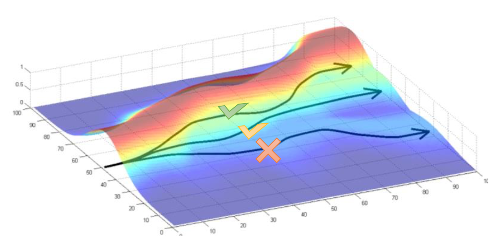
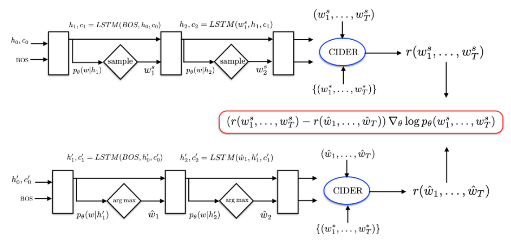
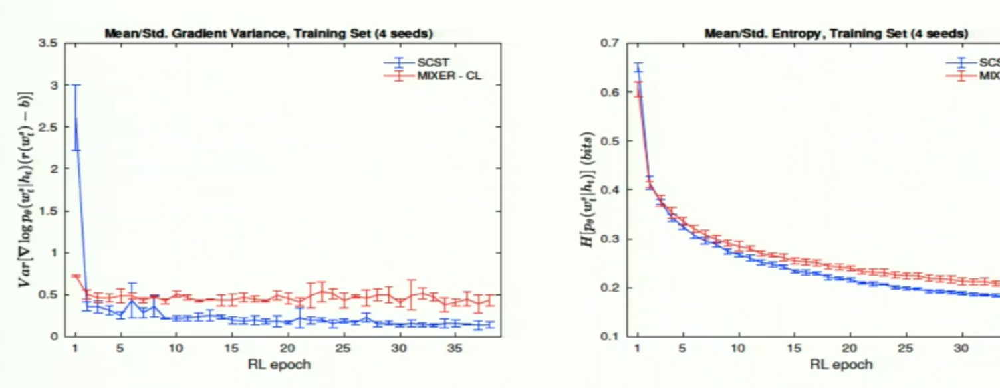

### 论文笔记：Self-Critical Sequence Training

本篇论文的SCST是IBM Watson提出的 Image Captioning 模型。SCST是REINFORCE算法的一个变种，利用自己的 test-time inference algorithm 来对 reward 作标准化（这里reward即句子的评分），也就是给REINFORCE算法提供一个更有效的 baseline $b(s)$。这与先前通过估算 baseline 方法来标准化rewards、减少方差的方法不同。

### 解决了什么问题
<!-- ##### Image Captioning
主要问题是，使用Nearest Neighbor Search，搜索空间过大 -->
##### Exposure Bias
传统的*Teacher Forcing*方法在训练时是将目标输出( training set 的 ground-truth)作为RNN的输入，同时用网络自己的一次性预测做多步采样。以ground-truth文本而非生成的词语作为先验。

在测试的时候，网络依赖的是自己生成的单词，一旦生成得不好就会导致误差积累，后面的单词也生成得不好，一步错则步步错。

以往这个问题是用*Professor Forcing*解决的，它使用adversarial training即对抗训练，来使从网络中采样的上文词汇尽量贴合ground truth。

### Why Reinforcement Learning?
<!-- 
$\theta _ { t + 1 } = \theta _ { t } + \alpha \nabla \overline{ { J } ( \theta _ { t } )}$

这里$\overline{ { J } ( \theta _ { t } )}$即是对模型表现的梯度预测 -->

我们知道强化学习解决的问题就是**一个agent如何在一个environment中采取行动以使cumulative reward最大化**。这个environment指agent作用的对象，比如在Atari里是游戏本身。

RL问题可以用Markov Decision Process来建模，其可概括为几大要素：   
$S$: environment和agent的状态集合  
$A$: agent的动作集合  
$P(s^{t+1}|s^{t}, a^{t})$: 状态转移方程，agent在$t$时间采取行动$a^{t}$从状态$s^{t}$ 转移到状态$s^{t+1}$的概率。在状态集和动作集离散且非连续时，通常可以用一个庞大的矩阵来表示，即状态转移矩阵。

而为什么Sequence Generation这类问题可以用RL来解决，我理解是由于生成单词的操作是不可微的，无法通过反向传播来直接优化这些指标。

NLP使用的预测模型，比如类RNN和LSTM模型，可以看作与一个外部环境（这里就是上文单词和图像特征）交互的agent。

### Policy Gradient (PG)
Policy gradient本身就是evaluation-based method，其agent可以自己探索文本更好的解释。我们可以这样用PG来model NLG或NLU等任务：

##### Environment  
$I$ - 输入图像（或者说**ResNet**提取过的图像特征）  
$w^{s}_{1:t-1}$ - 即$t$步以前生成的所有单词

##### Action  
$w^{s}_{t}$，t步生成的一个单词

##### Rewards  
$r(w^{s})$或者$r(w^{s}_{1:T})$。模型训练的衡量指标。这里最后一个时间点$T$输出的文本即是[EOS]

##### Objective function  
训练目标是最小化目标函数，即negative rewards

$\begin{aligned} L(\theta) &=-\mathbb{E}_{w^{s} \sim p_{\theta}}\left[r\left(w^{s}\right)\right] \\ & \approx-r\left(w^{s}\right), w^{s} \sim p_{\theta} \end{aligned}$

##### Policy  
$p_{\theta}\left(w_{t}^{s} \mid w_{1: t-1}^{s}, I\right)=p_{\theta}\left(w_{t}^{s} \mid h_{t}\right)$

$p_{\theta}$ 决定了对下一个单词的预测，可以看作是agent的一个“动作”（$\theta$是策略$p_{\theta}$的网络参数）。

梯度期望可以用一个从策略$p_{\theta}$中sample的Monte Carlo样本$w^s$做估计：$w^s = (w^{s}_1, w^{s}_2, ..., w^{s}_T)$. REINFORCE给出的策略梯度可以进而用于计算相对于reference reward (即baseline $b$)的action value的奖励：

$\nabla_{\theta} L(\theta)=-\mathbb{E}_{w^{s} \sim p_{\theta}}\left[r\left(w^{s}\right) \nabla_{\theta} \log p_{\theta}\left(w^{s}\right)\right]$

对于策略梯度更详细的解读，可以参考[IBM这篇文章](https://developer.ibm.com/zh/technologies/analytics/articles/ba-lo-deep-introduce-policy-gradient/)

### REINFORCE with baseline

为什么引入baseline方法，我理解是baseline就是一个学习到的value function，其本质上是对文本对应的reward起到一个zero-centering的作用。当策略已经较好时，我们预测一个不太好的样本，其输出的reward是一个非负的小值，这就导致传统的策略梯度算法会继续尝试增加产生这个轨迹的动作的概率，放到Levine著名的图里，就是把$w^{s}$对应的trajectory $\tau$提升上来，这里纵轴是动作产生概率。

这样，当我们normalize之后会导致学习效果不升反降。所以我们需要引入一个基准值，使得算法能够增加优于基准值的动作的概率，降低低于基准值动作的概率。

在策略$p_{\theta}$下生成所有可能的sequence的probability之和为1
$\begin{aligned} \mathbb{E}_{w^{*} \sim p_{\theta}}\left[b \nabla_{\theta} \log p_{\theta}\left(w^{s}\right)\right] &=b \sum_{w_{s}} \nabla_{\theta} p_{\theta}\left(w^{s}\right) \\ &=b \nabla_{\theta} \sum_{w_{s}} p_{\theta}\left(w^{s}\right) \\ &=b \nabla_{\theta} 1=0 \end{aligned}$

只要$\pi$对于动作$a$、状态$s$及所用策略的参数$\theta$都是可导的

Baseline不会改变梯度期望，但可以显著减小梯度估计的方差

$\frac { \partial L ( \theta ) } { \partial s _ { t } } \approx ( r ( w ^ { s } ) - b ) ( p _ { \theta } ( w _ { t } | h _ { t } ) - 1 _ { w _ { t } ^ { s } } )$

如果在reward function上减去一个任意的基线$b(s)$，结论仍然是成立的。这个baseline $b(s)$可以是不取决于$a$的任何方法。

### 模型结构

Encoder使用*ResNet-101*来生成图像特征，以cross entropy loss训练。  
Decoder使用*LSTM*来decode feature。LSTM最后输出的是每个单词的分数$s^t$，再通过softmax得到下一个单词$w^t$的概率分布。本文利用的是修改过的Attention Model(Att2in)，把attention feature输入到LSTM的cell node。使用attention能够让模型在不同时间点上聚焦不同的图像空间特征（即CNN encoder的输出）。

我们可以看到每个单词的权重是由采样得到的reward和test 时inference算法估计的reward之差决定的。SCST是用inference算法取代actor-critic中的critic网络。

## Results

SCST在training set上的方差与熵值。  
前几个epoch时，算法处在RL的Exploration阶段，方差偏大，但可以帮助模型找到更好的参数。而随后的epoch是算法的Exploitation阶段，方差明显低于*MIXER*

### 附：NLP 任务衡量指标
本文用到了NLP领域的四大metrics: BLEU4, Meteor, ROUGEL和有
BLEU、Meteor是评测机器翻译的指标，ROUGE是评测自动摘要(Automatic Summarization)的，而CIDEr和SPICE评价 caption 。
##### BLEU 双语替换评测
[BLEU (Bilingual Evaluation Understudy)](https://www.aclweb.org/anthology/P02-1040.pdf)衡量机器翻译结果，用于分析候选译文（待评价的译文）和参考译文中 N 元组(n-gram)共同出现的程度，介于0.0和1.0之间。

Clip count，把bigram出现最大次数限制在不超过reference translation中出现次数的范围内。

$P_n = \frac{\sum_{n-grams \in \hat{y}} Count\ Clip\ of\ n-grams}{Count\ of\ n-grams}$

注意如果机器翻译结果与其中一个参考结果完全一致，那所有的$P_n$得分都应该为1.0。通常n取1-4，然后我们取所有$P_n$得分的平均值（如果连续序列过长的话，其在机器翻译与reference中出现的概率肯定过小）

BP (Brewy Penalty): 其作用是防止所得的机器翻译过短。$BP = exp^{\frac{1}{n} \sum_{n}P_n}$

可以参考deeplearning.ai里[吴恩达老师的解释](https://youtu.be/DejHQYAGb7Q)

##### ROUGH-L
ROUGH-L是基于最长公共子序列(Longest Common Subsequence)的指标。

简而言之：

**BLEU衡量Precision**：机器生成Summary中的单词（或n-gram）在人工summary中出现的比率。

**ROUGH度量Recall**：人工summary中的单词（或n-gram）在机器生成的summary中出现的比率。

未完待续(Beam search)...

